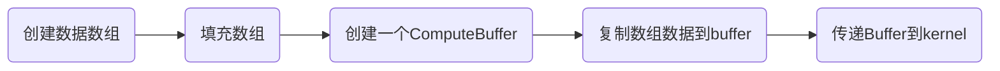
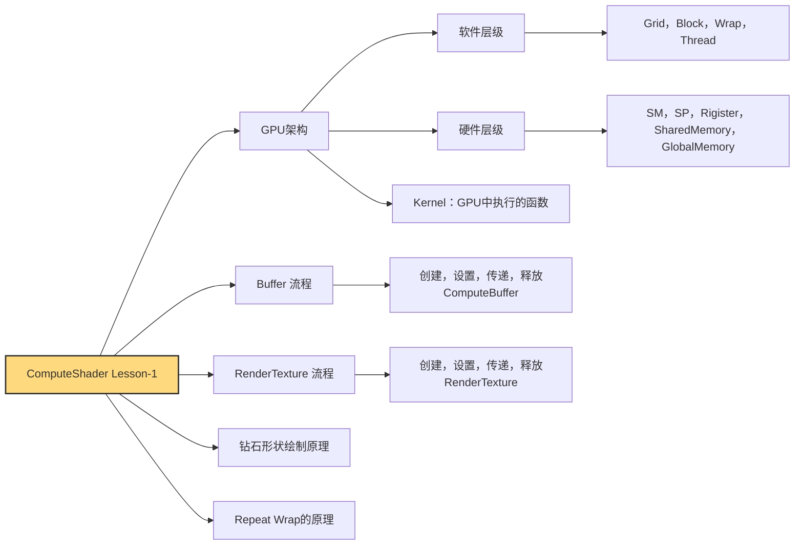

# `ComputeShader` Lesson-1
ComputeShader绘制动态钻石粒子纹理

:: note ::

\* by **Pavel**


---
layout: top-title-two-cols
color: sky
columns: is-one-half
align: c-lt-lt
title: 综述
---
:: title ::
# <mdi-book-open-variant /> 你将会学到

:: left ::
- 初步理解==GPU抽象架构==
- 设置==结构体==，结构体==数组==，创建并设置==Buffer==
- 创建并设置==RenderTexture==
- ComputeShader计算==2d粒子==，==无缝纹理==


:: right ::


---
layout: section
color: indigo
title: 1. 认识 `GPU` 架构
---

#  1. 认识 `GPU` 架构
<hr>
通过认识GPU，增强对ComputeShader操作掌握


---
layout: top-title
color: sky
align: c
title: GPU软件抽象层级对应关系
---

:: title ::

# <mdi-book-open-variant /> GPU软件抽象层级对应关系

:: content ::
| 概念    | 学校类比         | 描述                                                         |
|---------|------------------|--------------------------------------------------------------|
| Grid（网格）    | 年级             | 年级包含多个班级（Block），是任务调度的最高抽象层         |
| Block（线程组）   | 班级             | 每个班级由多个学生组成，独立执行任务                       |
| Warp（线程束）    | 兴趣小组         | 每组固定64人，执行相同任务；人数不够也会补齐               |
| Thread（线程）  | 学生             | 每个 Thread 是最小执行单元，有自己的寄存器（课桌）         |

<AdmonitionType type='important' >
- 在ComputeShader中Grid通过Dispatch(x,y,z)分配 <br>
- Block在ComputeShader中设置[numthreads(x,y,z)]<br>
- 受Wrap的结构影响Block大小通常为32的倍数(修改)
- 在Nvidia中一个wrap包含32个线程，在Amd中则是64个，所以线程组的尺寸最好是64的整数倍可以避免资源浪费。
</AdmonitionType>

---
layout: top-title
color: sky
align: c
title: GPU硬件资源层级对应关系
---

:: title ::

# <mdi-book-open-variant /> GPU硬件资源层级对应关系

:: content ::
| 概念    | 学校类比             | 描述                                                                 |
|---------|----------------------|----------------------------------------------------------------------|
| SM（流处理器单元）      | 教学楼的楼层         | 实际存在的硬件单元，可同时容纳多个班级（Block）                    |
| SP（流处理器核心）      | 学生（硬件级）       | 每个 Thread 分配到一个实际 SP 来执行                                |
| ==Rigister（寄存器）==  | 课桌                 | 每个 Thread/SP 独立的存储空间                                       |
| ==Shared Memory（共享内存）== | 教学楼公共空间  | 仅限同楼层内（同 SM）的线程共享访问                                 |
| ==Global Memory（全局内存）== | 操场/食堂等全校区域 | 所有 Grid 和 Block 都能访问的全局内存                               |

<AdmonitionType type='important' >
- Rigister的特点决定我们不能在线程之间通过普通变量“传值”或共享状态<br>
- Shared Memory只能在Block内用，常用来制作高斯模糊、Sobel边缘检测等<br>
- ComputeShader中的`RWTexture`, `ComputeBuffer` 存放在Global Memory
</AdmonitionType>

---
layout: side-title
side: l
color: sky
titlewidth: is-5
align: rm-lm
title: Block数量设置详解
---

:: title ::

# <mdi-book-open-variant /> Block数量设置详解

:: content ::


```c
numthreads(32,1,1)
```

- 一维线程组：多用来处理数组，绘制粒子。


```c
numthreads(8,8,1)
```

- 二维线程组：二维线程组多用来渲染RT，处理图像。


```c
numthreads(4,4,4)
```

- 三维线程组：三维线程组常用来处理顶点，体积数据，体渲染等。

---
layout: top-title-two-cols
color: sky
columns: is-one-half
align: c-lt-lt
title: ComputeShader与Shader
---

:: title ::

# <mdi-book-open-variant /> ComputeShader与Shader异同


:: left ::
## Shader


### VertexShader
- 输入：顶点数据（位置、UV、法线等）
- 输出：裁剪空间坐标、顶点相关数据

### FragmentShader
- 输入：顶点数据（位置、UV、法线等）
- 输出：像素颜色或深度值


:: right ::
## ComputeShader

- 输入：常量，只读型Buffer，只读型纹理，可读写的纹理
- 输出：可读写纹理，可读写Buffer

---
layout: top-title
color: sky
align: c
title: Kernel的含义
---

:: title ::
# <mdi-book-open-variant /> Kernel的含义

:: content ::
- Kernel 就是 GPU 可以被调度执行的一段入口函数
- 脚本用FindKernel()拿到句柄、绑资源，再用Dispatch()触发它在GPU上并行运行。
- 不同 kernel 可以有不同线程组规模和用途，让同一个 Compute Shader 文件既能做清屏，也能画钻石粒子。
```csharp {1-2|6|10|12|all}{maxHeight:'120px'}
int diomondsHandle;
int clearHandle;

...

diomondsHandle = shader.FindKernel("Diomonds");

...

shader.Dispatch(clearHandle, texResolution / 8, texResolution / 8, 1);
...
shader.Dispatch(diomondsHandle, count, 1, 1);
```

```csharp {1-2|4-8|10-14|all}{maxHeight:'120px'}
#pragma kernel Diomonds
#pragma kernel Clear

[numthreads(32,1,1)]
void Diomonds (uint3 id : SV_DispatchThreadID)
{
    ...
}

[numthreads(8,8,1)]
void Clear (uint3 id : SV_DispatchThreadID)
{
	...
}
```


---
layout: section
color: indigo
title: 2. Buffer设置
---

# <mdi-book-open-variant /> 2. Buffer设置
<hr>
构建结构体数组，建立，填充，传递与释放Buffer


---
layout: top-title
color: sky
align: c
title: Buffers的使用流程
---

:: title ::

# <mdi-book-open-variant /> Buffers的使用流程

:: content ::

<Mug :size="120" mood="excited" color="#ffe7b5" v-drag="[11,276,131,97]"/>
<Browser :size="120" mood="blissful" color="#c4e8ff" v-drag="[791,286,131,97]"/>
<SpeechBubble position="l" color='yellow-light' shape="round" maxWidth="300px" v-drag="[232,249,211,64]">
什么是Buffer？
</SpeechBubble>

<SpeechBubble position="r" color='sky-light' shape="round" maxWidth="300px" v-drag="[464,250,300,196]">
ComputeBuffer 就是 CPU 与 GPU 相互通信时的“传送带”。本质上是一个可用于读写的数据数组，可以存储任意类型。它的物理位置处在之前提到的共享内存上。
</SpeechBubble>

---
layout: top-title-two-cols
color: emerald
columns: is-one-half
align: c-lt-lt
title: 创建结构体，数组和Buffer
---
:: title ::

# <mdi-code-braces /> 创建结构体，数组和Buffer

:: left ::
## C#
- ==C#脚本==中创建结构体和数组

```csharp {1-6|8|12|all}
struct Diomonds
{
    public Vector2 origin;
    public Vector2 velocity;
    public float scale;
}

Diomonds[] diomondsData;

...

ComputeBuffer buffer;
```
:: right ::
## ComputeShader
- ==ComputeShader==中的结构体和接收用Buffer

```csharp {1-6|8|all}
struct diomonds
{
	float2 origin;
	float2 velocity;
	float scale;
};

StructuredBuffer<diomonds> diomondsBuffer;
```


---
layout: top-title
color: emerald
align: c
title: 填充数组内容
---

:: title ::

# <mdi-code-braces />填充数组内容

:: content ::

InitData函数中创建结构体和数组
- 取出<span class="bg-green-100 text-green-500 p-1 pl-3 pr-3 m-1 rounded font-size-5">kernel函数</span>中的x方向的线程组大小乘以count获得最终绘制数量
- 根据计算出的数量实例化数组
- for循环遍历数组并填充元素

<AdmonitionType type='tip' >
kernel Id是指向ComputeShader中的函数ID值，类型为int
</AdmonitionType>

```csharp {1|3|4-5|6|8-13|14-28|all}{maxHeight:'180px'}
private void InitData()
{
    diomondsHandle = shader.FindKernel("Diomonds");
    shader.GetKernelThreadGroupSizes(diomondsHandle, out uint threadGroupSizeX, out _, out _);
    int total = (int)threadGroupSizeX * count;
    diomondsData = new Diomonds[total];

    float speed = 100f;
    float halfSpeed = speed * 0.5f;
    float minScale = 5f;
    float maxScale = 10f;
    float scaleRange = maxScale - minScale;

    for (int i = 0; i < total; i++)
    {
        Diomonds d = new Diomonds
        {
            origin = new Vector2(Random.value * texResolution, Random.value * texResolution),
            velocity = new Vector2((Random.value * speed) - halfSpeed, (Random.value * speed) - halfSpeed),
            scale = Random.value * scaleRange + minScale
        };
        diomondsData[i] = d;
    }
}
```
---
layout: top-title
color: emerald
align: c
title: 设置Buffer
---
:: title ::

# <mdi-code-braces /> 设置Buffer

:: content ::
- 计算数组元素（每个结构体）大小
- 实例化ComputeBuffer，传入数组长度，元素大小
- 将数组数据设置到buffer中
- 将buffer传递到ComputeShader

```csharp {1|5|6|7|8|9|all}{maxHeight:'150px'}
    private void InitShader()
    {
        if (shader == null || outputTexture == null) return;
        
        int stride = (2 + 2 + 1) * 4;
        if (buffer != null) buffer.Dispose();
        buffer = new ComputeBuffer(diomondsData.Length, stride);
        buffer.SetData(diomondsData);
        shader.SetBuffer(diomondsHandle, "diomondsBuffer", buffer);
    }
```

<AdmonitionType type="important" width="700px">
一个 float 占 4 个字节（bytes） 是因为它使用的是 IEEE 754 单精度浮点数格式（single-precision floating point format），这是现代 GPU 和 CPU 默认使用的标准浮点格式。
</AdmonitionType>

---
layout: top-title
color: emerald
align: c
title: 释放Buffer
---
:: title ::

# 释放Buffer

:: content ::
注意有两个重要的释放内存的时机：
- 初始化阶段（修改buffer内容时需要删掉旧的，创建新的）
- 声明周期结束时
```csharp{1-6|8-11|13-22|all}{maxHeight:'250px'}
    private void InitShader()
    {
        ...
        if (buffer != null) buffer.Dispose();
        ...
    }

    private void OnDestroy()
    {
        ReleaseResources();
    }
    
    private void ReleaseResources()
    {
        if (buffer != null)
        {
            buffer.Dispose();
            buffer = null;
        }

        ...
    }

```


---
layout: section
color: indigo
title: 3. RenderTexture
---

# 3. RenderTexture设置
<hr>
新建RT与设置RT，CS绘制RT，释放RT

---
layout: top-title-two-cols
color: emerald
columns: is-5
align: c-lt-lt
title: 新建，传递与释放RenderTexture
---

:: title ::
# <mdi-code-braces /> 新建，传递与释放RenderTexture

:: left ::
## C#中新建传递释放RT
- new一个RenderTexture
- 开启随机写，环绕模式为Repeat，实际创建RT
- 设置RT到指定kernel中
- 与buffer类似需要在初始化和生命周期结束时释放
```csharp {1|4|6|10-16|14|20-32|24-27|28|29|30|31|32|15|40|41|45|53-57|all}{maxHeight:'150px'}
public class DiomondsController : MonoBehaviour
{
    ...
    public int texResolution = 1024;
    ...
    RenderTexture outputTexture;

    ...
    ...
    
    void OnEnable()
    {
        ...
        SetupOutputTexture();
        InitShader();
        ...
    }

    ...
    ...

    private void SetupOutputTexture()
    {
        if (outputTexture != null)
        {
            outputTexture.Release();
        }

        outputTexture = new RenderTexture(texResolution, texResolution, 0);
        outputTexture.enableRandomWrite = true;
        outputTexture.wrapMode = TextureWrapMode.Repeat;
        outputTexture.Create();
    }
    ...


    private void InitShader()
    {
        ...
        shader.SetTexture(diomondsHandle, "Result", outputTexture);
        shader.SetTexture(clearHandle, "Result", outputTexture);
        ...

        ...
        rend.sharedMaterial.SetTexture("_MainTex", outputTexture);
        ...
    }

    private void ReleaseResources()
    {
        ...

        if (outputTexture != null)
        {
            outputTexture.Release();
            outputTexture = null;
        }
    }
}
```
:: right ::
## ComputeShader接受并写入RT
- 使用RWTexture2D来接收脚本设置的RT
- 使用id索引写入颜色

```csharp {1|14|6|20||all}{maxHeight:'200px'}
shared RWTexture2D<float4> Result;

void drawDiamondRepeat(int2 center, int size)
{
    ...
	Result[uint2(pos)] = diomondsColor;
    ...
}

[numthreads(32,1,1)]
void Diomonds (uint3 id : SV_DispatchThreadID)
{
    ...
	drawDiamondRepeat( center, scale );
}

[numthreads(8,8,1)]
void Clear (uint3 id : SV_DispatchThreadID)
{
	Result[id.xy] = clearColor;
}
```


---
layout: top-title-two-cols
color: sky
columns: is-5
align: c-lt-lt
title: 绘制RT时的Block（线程组）与纹理
---

:: title ::
# <mdi-book-open-variant /> 绘制RT时的Block（线程组）与纹理


:: left ::
<script setup>
const groupSize = 8
const groupID = { x:0 , y: 0 }
</script>

一个线程组的线程分布（groupID = (0,0,0)）

<div class="flex flex-col items-center gap-2">
  <div class="grid grid-cols-8 gap-[1px]">
    <div
      v-for="i in groupSize * groupSize"
      :key="i"
      class="w-[42px] aspect-square text-[10px] flex items-center justify-center font-mono text-black bg-yellow-200 border border-gray-300"
    >
      {{
        ((i - 1) % groupSize) + groupID.x * groupSize
      }}, {{
        (groupSize - 1 - Math.floor((i - 1) / groupSize)) + groupID.y * groupSize
      }}
    </div>
  </div>

  <div class="mt-1 text-sm">
    🟨 当前线程组位置：<strong>groupID = ({{ groupID.x }}, {{ groupID.y }}, 0)</strong>
  </div>

  <div class="text-xs text-gray-500 mt-1 text-center leading-tight">
    每个线程的 <code>SV_DispatchThreadID.xy</code> = 
    <code>groupID * groupSize + threadID</code>
  </div>
</div>

<ArrowDraw color='yellow' v-drag="[406,356,140,52,-6]"/>

:: right ::
线程组在纹理中的位置映射
<div class="flex justify-center">
  <div
    class="grid grid-cols-8 grid-rows-8 gap-[1px] bg-gray-700"
    style="width: 256px; height: 256px"
  >
    <div
      v-for="i in 64"
      :key="i"
      class="bg-gray-200 border border-gray-400"
      :class="{
        'bg-yellow-300': i === 57  // 左下角第一个 cell（row=8, col=1）
      }"
    ></div>
  </div>
</div>

<div class="text-sm mt-3 text-center text-gray-600">
  ⬜️ 整张纹理由 8×8 个线程组绘制，<br />
  🟨 高亮块（黄色）是 <strong>groupID = (0,0)</strong>
</div>

---
layout: top-title-two-cols
color: emerald
columns: is-7
align: c-lt-lt
title: drawDiamondRepeat函数解析
---

:: title ::

# <mdi-code-braces /> drawDiamondRepeat函数解析

:: right ::
### drawDiamondRepeat原理示意（size = 2）

<div class="flex justify-center mt-4">
  <div class="grid grid-cols-5 gap-[2px] bg-gray-100 p-2 rounded shadow">
    <div v-for="(row, rowIndex) in 5" :key="rowIndex" class="contents">
      <div
        v-for="(col, colIndex) in 5"
        :key="colIndex"
        class="w-[32px] h-[32px] flex items-center justify-center text-sm font-mono border border-gray-300"
        :class="{
          'bg-blue-300': Math.abs(2 - rowIndex) + Math.abs(2 - colIndex) <= 2,
          'bg-yellow-300 font-bold': rowIndex === 2 && colIndex === 2
        }"
      >
        {{
          rowIndex === 2 && colIndex === 2
            ? 'C'
            : Math.abs(2 - rowIndex) + Math.abs(2 - colIndex) <= 2
              ? 'X'
              : ''
        }}
      </div>
    </div>
  </div>
</div>

<div class="mt-4 text-center text-sm text-gray-600">
  使用钻石中心点 <strong>C</strong> 和半径 <code>size = 2</code><br>
  绘制出对称的钻石区域，蓝色表示被绘制的像素点 <strong>X</strong>
</div>
:: left ::
- 在y方向上遍历从-size开始到size，记录下左右扩张的范围span
- 在x方向上遍历从-span到span，填充对应位置的颜色
```csharp {3|4|5-12|all}
void drawDiamondRepeat(int2 center, int size)
{
	for (int y = -size; y <= size; y++) {
		int span = size - abs(y);
		for (int x = -span; x <= span; x++) {
			int2 pos = center + int2(x, y);

			...

			Result[uint2(pos)] = diomondsColor;
		}
	}
}
```


---
layout: top-title-two-cols
color: emerald
columns: is-2
align: c-lt-lt
title: warpPos函数解析
---
:: title ::

# <mdi-code-braces /> warpPos函数解析

:: right ::

<script setup>
const texResolution = 4
// 横轴显示 -1 到 4
const labels = [-1, 0, 1, 2, 3, 4]
// 要演示的输入点
const inputs = [-1, 4]
// wrapPos 映射后的输出点
const outputs = inputs.map(x => (x % texResolution + texResolution) % texResolution)
</script>

### wrapPos 映射演示

<div class="flex flex-col items-center mt-4 space-y-2">
  <!-- 输入点（红色圆点在坐标轴上方） -->
  <div class="relative w-full max-w-lg">
    <!-- 轴线 -->
    <div class="absolute inset-x-0 top-1/2 border-t border-gray-400"></div>
    <!-- 刻度与红点 -->
    <div class="grid grid-cols-6 relative">
      <div
        v-for="(lbl, i) in labels"
        :key="i"
        class="flex flex-col items-center"
      >
        <div
          v-if="inputs.includes(lbl)"
          class="w-4 h-4 bg-red-400 rounded-full mb-1"
        ></div>
        <div class="text-sm">{{ lbl }}</div>
      </div>
    </div>
  </div>
  <div class="text-gray-600 text-sm">输入越界点</div>

  <!-- 公式 -->
  <div class="text-gray-700 text-sm">
    wrapPos(x) = (<code>x % {{texResolution}} + {{texResolution}}</code>) % {{texResolution}}
  </div>

  <!-- 输出点（绿色圆点在坐标轴下方） -->
  <div class="relative w-full max-w-lg">
    <div class="absolute inset-x-0 top-1/2 border-t border-gray-400"></div>
    <div class="grid grid-cols-6 relative">
      <div
        v-for="(lbl, i) in labels"
        :key="i"
        class="flex flex-col items-center"
      >
        <div class="mb-1 h-4">
          <div
            v-if="outputs.includes(lbl)"
            class="w-4 h-4 bg-green-300 rounded-full"
          ></div>
        </div>
        <div class="text-sm">{{ lbl }}</div>
      </div>
    </div>
  </div>
  <div class="text-gray-600 text-sm">映射后结果</div>
</div>

:: left ::

这个函数用来实现对输入的位置进行Repeat类型的Wrap操作，主要用在两个地方

- 钻石中心位置的Repeat

- 绘制钻石像素时对填充像素位置的Repeat

```c
float2 warpPos(float2 origin)
{
	return float2((origin.x % texResolution + texResolution) % texResolution,
				  (origin.y % texResolution + texResolution) % texResolution);
}
```

<AdmonitionType type="tip" width="500px">
取两次余是为了处理负值的Wrap，例如如果pos的x=-1，texResolution = 4，通过除以纹理大小取余再加上纹理大小转换成向正方向越界的等效值。
</AdmonitionType>

---
layout: top-title
color: sky
align: c
title: 总结
---
:: title ::

# <mdi-book-open-variant /> 总结

:: content ::



---
layout: top-title
color: sky
align: c
title: 参考链接&拓展阅读
---

:: title ::

# <mdi-book-open-variant /> 参考链接&工程链接


:: content ::

- [深入理解 ComputeShader（CSDN 文章）](https://blog.csdn.net/qq_41554005/article/details/119760698)
- [Interactive Graphics 20 - Compute & Mesh Shaders](https://www.youtube.com/watch?v=HH-9nfceXFw&t=3305s)

- [Compute Shaders Rendering One Million Cubes](https://catlikecoding.com/unity/tutorials/basics/compute-shaders/)

- [ComputeShaderLesson-1工程源码](https://github.com/PavelPeng7/ComputeShaderStudy-Lesson1.git)


