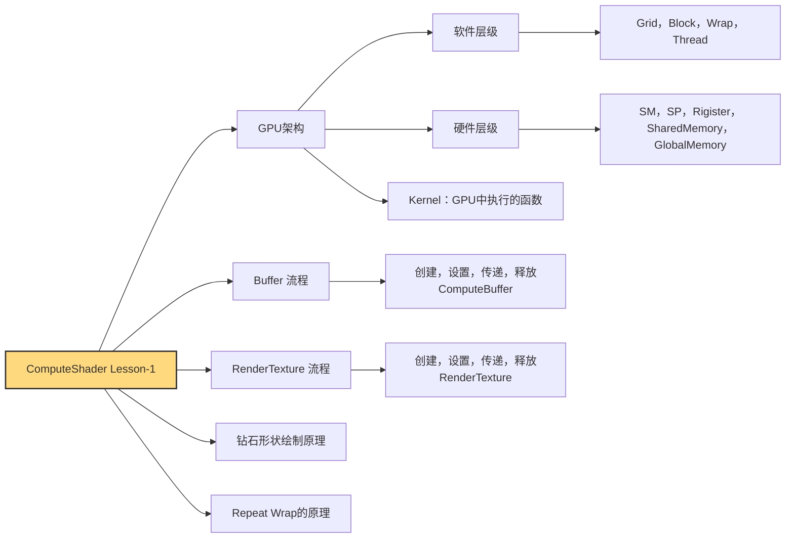

# 图解`ComputeShader` -2
ComputeShader绘制陨石实例(GPU Instance)

:: note ::
\* by **Pavel**


---
layout: top-title-two-cols
color: yellow
columns: is-one-half
align: c-lt-lt
title: 问题：如何高效的绘制大量陨石？
---
:: title ::
# <mdi-help-circle /> 问题：如何高效的绘制大量陨石？

:: left ::
- 陨石能够有不同的位移，大小，旋转
- 陨石沿着一定轨道运动，不同陨石有材质变化

<div class="ns-c-iconlink">
  <a href="https://pavelblog-images-1333471781.cos.ap-shanghai.myqcloud.com/ObsidianImages/PPT_watermark_2048x2048.png?imageSlim" target="_blank">
    
  </a>
</div>


:: right ::
<div class="flex flex-col items-center w-[100%]">
  
  <div class="text-gray-600"></div>
</div>


---
layout: section
color: sky
title: 1. GPU Instance简介
---

#  1. `GPU Instance`简介
<hr>
高性能绘制大量相同物体的强大的方法


---
layout: top-title
color: sky
align: c
title: 介绍三种绘制陨石的方法
---

:: title ::

# <mdi-book-open-variant /> 介绍三种绘制陨石的方法

:: content ::
<div class="text-sm overflow-x-auto">

| API | 实例创建 | Draw Call | 数量限制 | 典型用途 |
|-----|----------|-----------|----------|----------|
| **Object.Instantiate** | 克隆Prefab | 多次 | 随着数量上升性能大幅度下降 | 少量带脚本物体 |
| **DrawMeshInstanced­Procedural** | CPU一次DrawCall | 1 次 | CPU传count | 稳定大批粒子、草 |
| **DrawMeshInstanced­Indirect** | 同上 | 1 次 | GPU更新ArgsBuffer | GPU剔除草海、爆破碎片 |

</div>

<div class="flex justify-center items-start gap-6 text-center text-[12px]">
  <div class="flex flex-col items-center w-[30%]">
    
    <div class="text-gray-600">❌ Instantiate: 逐个创建 GameObject
    </div>
  </div>

  <div class="flex flex-col items-center w-[30%]">
    
    <div class="text-gray-600">✔️ Procedural: GPU 直接绘制，数量由 CPU 提供</div>
  </div>

  <div class="flex flex-col items-center w-[30%]">
    
    <div class="text-gray-600">✔️ Indirect: GPU视锥体剔除</div>
  </div>
</div>

---
layout: top-title-two-cols
color: sky
columns: is-one-half
align: c-lt-lt
title: 传统绘制与GPUInstance在数据处理上的对比
---

:: title ::
# <mdi-book-open-variant /> 传统绘制与GPUInstance在数据处理上的对比

:: left ::
### 传统绘制（逐实例 Draw）
<div class="space-y-2 text-[13px] font-mono">
  <div class="px-3 py-1 rounded bg-red-50 border border-red-300">for (i = 0; i < N; ++i)</div>
  <div class="px-3 py-1 rounded bg-red-50 border border-red-300">SetPerObject(i)</div>
  <div class="px-3 py-1 rounded bg-red-50 border border-red-300">DrawCall()</div>
  <div class="px-3 py-1 rounded bg-red-100 border border-red-300">CPU循环N次</div>
</div>

#### 提交时间轴
<div class="mt-3 flex flex-wrap gap-1">
  <div v-for="n in 8"
       class="w-[54px] h-[28px] flex items-center justify-center text-[11px] rounded bg-red-300 text-white">
    Draw {{n}}
  </div>
</div>
<div class="mt-2 text-xs text-gray-500">
  ⏱️ *指令提交串行&驱动开销累计*
</div>

:: right ::
### Instancing / Indirect（一次批处理）
<div class="space-y-2 text-[13px] font-mono">
  <div class="px-3 py-1 rounded bg-emerald-50 border border-emerald-300">Upload Mesh(共享)</div>
  <div class="px-3 py-1 rounded bg-emerald-50 border border-emerald-300">Upload InstanceBuffer[N]</div>
  <div class="px-3 py-1 rounded bg-emerald-200 border border-emerald-400">DrawInstanced/Indirect(1 次)</div>
  <div class="px-3 py-1 rounded bg-emerald-100 border border-emerald-300">GPU内部并行展开N个实例</div>
</div>

#### 提交时间轴
<div class="mt-3 flex items-center gap-2">
  <div class="w-[120px] h-[34px] flex items-center justify-center text-[12px] rounded bg-emerald-500 text-white">
    单次 Draw
  </div>
  <div class="text-2xl">⇒</div>
  <div class="grid grid-cols-8 gap-[2px]">
    <div v-for="n in 16"
         class="w-[18px] h-[18px] rounded bg-emerald-200 border border-emerald-400"></div>
  </div>
</div>
<div class="mt-2 text-xs text-gray-500">
  ⚡ *一次命令→GPU线程并行消处理实例数据*
</div>


---
layout: top-title
color: sky
align: c
title: Procedural vs Indirect
---

:: title ::
# <mdi-book-open-variant /> Procedural vs Indirect

:: content ::
虽然二者都是GPUInstance绘制，但是实现方式，用途有一些区别。

<v-clicks at="+0" class="ns-c-fader">

- Procedural（DrawMeshInstancedProcedural）：
GPU 负责绘制，CPU 直接指定实例数量（count），实例数据通常来自 StructuredBuffer，不支持GPU裁剪。适合==实例数已知、裁剪需求不高==的情况。
- Indirect（DrawMeshInstancedIndirect）：
GPU负责绘制，实例数量由GPU决定（如由 ComputeBuffer 裁剪后CopyCount得到）。适合大规模实例、需要==GPU动态剔除==或其他运行时调整的场景。

</v-clicks>

<Box v-drag="[625,347,163,89]" shape='r-d-2-70' color='orange-light' custom='pt-0'>添加</Box>

<div class="grid grid-cols-2 gap-8 text-[12px] font-sans select-none">

  <!-- Procedural -->
  <div class="space-y-2">
    <div class="text-center font-bold text-sky-600">Procedural</div>
    <div class="flex flex-col items-center gap-1 font-mono">
      <div class="px-2 py-[2px] rounded bg-gray-100 border border-gray-300">CPU: count=N</div>
      <div class="px-2 py-[2px] rounded bg-sky-100 border border-sky-300">InstanceBuffer(N)</div>
      <div class="px-2 py-[2px] rounded bg-sky-200 border border-sky-500">DrawProcedural(N)</div>
      <div class="px-2 py-[2px] rounded bg-emerald-100 border border-emerald-300">GPU 并行 N</div>
    </div>
    <div class="text-[10px] text-gray-500 leading-snug">
      固定 N；剔除需 CPU 改 count
    </div>
  </div>

  <!-- Indirect -->
  <div class="space-y-2">
    <div class="text-center font-bold text-emerald-600">Indirect</div>
    <div class="flex flex-col items-center gap-1 font-mono">
      <div class="px-2 py-[2px] rounded bg-gray-100 border border-gray-300">CPU init</div>
      <div class="px-2 py-[2px] rounded bg-sky-100 border border-sky-300">InstanceBuffer</div>
      <div class="px-2 py-[2px] rounded bg-yellow-100 border border-yellow-300">Compute剔除</div>
      <div class="px-2 py-[2px] rounded bg-purple-100 border border-purple-300">CopyCount→Args</div>
      <div class="px-2 py-[2px] rounded bg-emerald-200 border border-emerald-500">DrawIndirect(M)</div>
      <div class="px-2 py-[2px] rounded bg-emerald-100 border border-emerald-300">GPU 并行 M</div>
    </div>
    <div class="text-[10px] text-gray-500 leading-snug">
      M 由 GPU 决定；适合大规模 + 动态剔除
    </div>
  </div>
</div>

---
layout: section
color: emerald
title: 2. InstancedProcedural解析
---

# 2. `InstancedProcedural`解析
<hr>
设置Computebuffer，CS中计算陨石参数，设置Buffer到材质。

---
layout: top-title
color: emerald
align: c
title: GPUInstanceProcedrual API
---

:: title ::

# <mdi-code-braces /> GPUInstanceProcedrual API


:: content ::
```csharp {all}{maxHeight:'150px'}
Graphics.DrawMeshInstancedProcedural(
  mesh,
  0, 
  runtimeMaterial, 
  new Bounds(Vector3.zero, Vector3.one * 1000f), meteorCount);
```

| 参数名        | 说明                                                                 |
|---------------|----------------------------------------------------------------------|
| `mesh`        | 要绘制的 Mesh                                                        |
| `submeshIndex`| 要绘制的子网格索引，仅当 Mesh 包含多个材质时适用                     |
| `material`    | 使用的材质（Material）                                               |
| `bounds`      | 包围所有实例的包围体（Bounds）                                       |
| ==count==       | 要绘制的实例数量（instance count）                                   |


---
layout: top-title
color: emerald
align: c
title: 构建陨石结构体和buffer
---

:: title ::
# <mdi-code-braces /> 构建陨石结构体和buffer

:: content ::
- C#脚本中：
```csharp {1-7|9|all}{maxHeight:'120px'}
    struct Meteor
    {
        public Vector3 position;
        public Vector3 scale;
        public Vector3 rotation;
        public float seed;
    }
    
    ComputeBuffer meteorsInputBuffer; 
```

- ComputeShader中:
```csharp {1-7|9|all}{maxHeight:'120px'}
struct Meteor
{
    float3 position;
    float3 scale;
    float3 rotation;    
    float seed;
};

RWStructuredBuffer<Meteor> _meteorsInput;
```
<Admonition title="Info" color='teal-light' width="500px">
MeteorBuffer的大小计算：(10 x 4字节 x 200个实例) / 1024 = 7.8kb
</Admonition>

---
layout: top-title
color: emerald
align: c
title: Buffer的一生
---

:: title ::

# <mdi-code-braces />  Buffer的一生

:: content ::

<div class="font-sans text-[13px] select-none">
  <div class="grid grid-cols-3 gap-4 text-center font-bold mb-2">
    <div class="text-gray-700">Mono 生命周期</div>
    <div class="text-sky-600">Buffer 操作</div>
    <div class="text-gray-400 text-[12px]">说明</div>
  </div>

  <div class="grid grid-cols-3 gap-4 items-center text-[12px] font-mono mb-1">
    <div class="bg-gray-100 border px-2 py-[2px]">OnEnable</div>
    <div class="bg-emerald-100 border border-emerald-400 px-2 py-[2px]">初始化Buffer</div>
    <div class="text-gray-500">创建ComputeBuffer</div>
  </div>

  <div class="grid grid-cols-3 gap-4 items-center text-[12px] font-mono mb-1">
    <div class="bg-gray-100 border px-2 py-[2px]">OnValidate</div>
    <div class="bg-purple-100 border border-purple-400 px-2 py-[2px]">参数改变触发重新初始化Buffer</div>
    <div class="text-gray-500"></div>
  </div>

  <div class="grid grid-cols-3 gap-4 items-center text-[12px] font-mono mb-1">
    <div class="bg-gray-100 border px-2 py-[2px]">Update</div>
    <div class="bg-yellow-100 border border-yellow-400 px-2 py-[2px]">更新Buffer，提交绘制命令</div>
    <div class="text-gray-500">如Dispatch或SetData（在新建Buffer前释放旧Buffer）</div>
  </div>

  <div class="grid grid-cols-3 gap-4 items-center text-[12px] font-mono">
    <div class="bg-gray-100 border px-2 py-[2px]">OnDisable/OnDestroy</div>
    <div class="bg-red-100 border border-red-400 px-2 py-[2px]">释放 Buffer</div>
    <div class="text-gray-500">Release()防止内存泄漏</div>
  </div>
</div>

```csharp {1-8|10-17|19|24|28|30|33-37|39|41|43-47|all}{maxHeight:'200px'}
    void OnEnable()
    {
      ...

      AllocateOrResizeAllBuffers();

      ...
    }

    void OnValidate()
    {
      ...

      AllocateOrResizeAllBuffers();

      ...
    }

    void Update()
    {
        ...
        

        computeShader.SetBuffer(kernelHandle, meteorsInputBufferId, meteorsInputBuffer);

        ...

        computeShader.Dispatch(kernelHandle, dispatchGroupsX, 1, 1);
        
        runtimeMaterial.SetBuffer(materialBufferId, meteorsInputBuffer);
    }

    void OnDisable()
    {
        ReleaseBuffer(ref meteorsInputBuffer);
        ...
    }

    void AllocateOrResizeAllBuffers()
    {
      int stride = sizeof(float) * 10;

      if (meteorsInputBuffer == null || meteorsInputBuffer.count != meteorCount)
      {
          ReleaseBuffer(ref meteorsInputBuffer);
          meteorsInputBuffer = new ComputeBuffer(meteorCount, stride, ComputeBufferType.Structured);
      }

      ...
    }
```

---
layout: top-title-two-cols
color: emerald
columns: is-5
align: c-lt-lt
title: Shader支持Instance
---
:: title ::
# <mdi-code-braces /> Shader支持Instance

:: left ::
## InjectPrograms
- 启用两个实例化渲染的两个关键编译指令

```c {1-6|8|12|all}{maxHeight:'150px'}
#pragma instancing_options 
assumeuniformscaling procedural:ConfigureProcedural
#pragma editor_sync_compilation
```

<div class="flex flex-col items-center w-[100%]">
  
  <div class="text-gray-600">InjectPrograms采用String类型</div>
</div>

:: right ::
## MeteorInstance
- 接受从C#脚本中设置的Buffer，提取其中的参数用于渲染
```csharp {1-10|14-23|17|18-21|25-30|32|all}{maxHeight:'150px'}
#if defined(UNITY_PROCEDURAL_INSTANCING_ENABLED)
    struct MeteorProps
    {
        float3 Position;
        float3 Scale;
        float3 Rotation; 
        float seed;
    };
    StructuredBuffer<MeteorProps> _MeteorBuffer;
#endif

float _seed;

void ConfigureProcedural()
{
    #if defined(UNITY_PROCEDURAL_INSTANCING_ENABLED)
    MeteorProps data = _MeteorBuffer[unity_InstanceID];
    float3 position = data.Position;
    float3 scale    = data.Scale;
    float3 rotation = data.Rotation;
    float seed = data.seed;
    #endif
}

void MeteorInstance_float(float4 inPos, out float4 outPos, out float outSeed)
{
    ...
    outSeed = _seed;
    outPos = inPos;
}

void MeteorInstance_half(half4 In, out half4 Out) { Out = In; }
```

<div class="flex flex-col items-center w-[90%]">
  
  <div class="text-gray-600">MeteorInstance采用File类型</div>
</div>

---
layout: top-title
color: emerald
align: c
title: GPU填充Buffer
---

:: title ::

# <mdi-code-braces /> GPU填充Buffer

:: content ::

与前一章使用CPU计算数组填充buffer不同，我们在这里使用GPU计算内容填充。<br>

```csharp {1|5|10-13|14|15|all}{maxHeight:'200px'}
[numthreads(64,1,1)]
void MeteorInstancer(uint3 id : SV_DispatchThreadID)
{
    uint idx = id.x;
    if (idx >= _count) return;   // 越界保护

    ...

    // 写入全量
    Meteor m;
    m.position = pos;
    m.scale    = scl;
    m.rotation = axisAngle;
    m.seed = hash(idx, 37.21);
    _meteorsInput[idx] = m;

    ...
    ...
}
```
---
layout: top-title
color: emerald
align: c
title: 随机正交基坐标系
---
:: title ::

# <mdi-code-braces /> 随机正交基坐标系

:: content ::
为每个实例生成一个局部坐标系，特别是在 GPU 实例化中非常常见，用于控制旋转方向或运动路径。
```csharp {1|2|3|all}{maxHeight:'150px'}
float3 sinDir = normalize(hash3(idx) - 0.5);
float3 vec    = normalize(hash3(idx + 71.393) - 0.5);
float3 cosDir = normalize(cross(sinDir, vec));
```
<div class="flex flex-col items-center w-[90%]">
  
  <div class="text-gray-600">叉乘示意图</div>
</div>

---
layout: top-title
color: emerald
align: c
title: 轨道位置，旋转，缩放
---
:: title ::

# <mdi-code-braces /> 轨道位置，旋转，缩放

:: content ::

```csharp {1-4|6-8|10-11|13-16|18-21|23-28|29|all}{maxHeight:'150px'}
    //  随机正交基
    float3 sinDir = normalize(hash3(idx) - 0.5);
    float3 vec    = normalize(hash3(idx + 71.393) - 0.5);
    float3 cosDir = normalize(cross(sinDir, vec));

    // 时间 & 相位
    float basePhase  = hash(idx, 11.27) * 6.2831853;
    float scaledTime = _time * _speed + basePhase;

    // 轨道位置
    float3 pos = (sinDir * sin(scaledTime) + cosDir * cos(scaledTime)) * _range;

    // 自转
    float spinSpeed = lerp(2.0, 8.0, hash(idx, 37.21));
    float angleRad  = scaledTime * spinSpeed;
    float3 axisAngle = sinDir * angleRad;

    // 缩放
    float rand01 = hash(idx, 19.87);
    float s = lerp(_minScale, _maxScale, rand01);
    float3 scl = float3(s,s,s);

    // 写入Buffer
    Meteor m;
    m.position = pos;
    m.scale    = scl;
    m.rotation = axisAngle;
    m.seed = hash(idx, 37.21);
    _meteorsInput[idx] = m;
```

<div class="grid grid-cols-2 gap-4 text-sm text-center select-none mt-2">
  <!-- 平面圆轨道 -->
  <div>
    <div class="font-bold text-blue-600 mb-1">
      固定平面圆轨道<br />
      <span class="text-[11px] text-gray-500">(x² + y² = r²)</span>
    </div>
    <div class="relative h-[150px] w-full flex justify-center items-center">
      <svg viewBox="0 0 200 200" class="w-[130px] h-[130px] drop-shadow-sm">
        <circle cx="100" cy="100" r="60" stroke="#4F46E5" stroke-width="2" fill="#93C5FD22" />
        <line x1="100" y1="100" x2="160" y2="100" stroke="#4F46E5" stroke-width="1" stroke-dasharray="4 2"/>
        <circle cx="160" cy="100" r="4" fill="#1D4ED8" />
        <text x="165" y="95" font-size="5" fill="#1D4ED8">pos(t)</text>
      </svg>
    </div>
    <p class="text-[11px] text-gray-500 leading-tight">
      X-Y平面固定<br />通常用于2D UI / 数学图形
    </p>
  </div>

  <!-- 三维轨道 -->
  <div>
    <div class="font-bold text-emerald-600 mb-1">
      三维空间轨道<br />
      <span class="text-[11px] text-gray-500">(sinDir/cosDir 构造)</span>
    </div>
    <div class="relative h-[150px] w-full flex justify-center items-center">
      <svg viewBox="0 0 200 200" class="w-[140px] h-[140px] drop-shadow-sm">
        <ellipse cx="100" cy="100" rx="65" ry="35" fill="#34D39922" stroke="#10B981" stroke-width="2"/>
        <circle cx="135" cy="75" r="4" fill="#059669" />
        <line x1="100" y1="100" x2="135" y2="75" stroke="#10B981" stroke-width="1" stroke-dasharray="4 2"/>
        <text x="140" y="70" font-size="5" fill="#059669">pos(t)</text>
      </svg>
    </div>
    <p class="text-[11px] text-gray-500 leading-tight">
      任意方向平面<br />适合粒子轨道 / GPU 动画
    </p>
  </div>
</div>

---
layout: top-title
color: emerald
align: c
title: Shader中应用位置，旋转，缩放
---
:: title ::

# <mdi-code-braces /> Shader中应用位置，旋转，缩放

:: content ::

```csharp {1|2|3|all}{maxHeight:'150px'}
void ConfigureProcedural()
{
    #if defined(UNITY_PROCEDURAL_INSTANCING_ENABLED)
    MeteorProps data = _MeteorBuffer[unity_InstanceID];

    float3 position = data.Position;
    float3 scale    = data.Scale;
    float3 rotation = data.Rotation; // 假设这里是欧拉角表示 (x,y,z) 对应绕X、Y、Z轴的旋转
    float seed = data.seed;
    
    // 创建旋转矩阵 - 先将欧拉角转换为旋转矩阵
    // 注意：旋转顺序为 ZYX (绕Z轴旋转，然后Y轴，最后X轴)
    float3x3 rotX, rotY, rotZ;
    
    // 绕X轴旋转
    float sinX, cosX;
    sincos(rotation.x, sinX, cosX);
    rotX = float3x3(
        1, 0, 0,
        0, cosX, -sinX,
        0, sinX, cosX
    );
    
    // 绕Y轴旋转
    float sinY, cosY;
    sincos(rotation.y, sinY, cosY);
    rotY = float3x3(
        cosY, 0, sinY,
        0, 1, 0,
        -sinY, 0, cosY
    );
    
    // 绕Z轴旋转
    float sinZ, cosZ;
    sincos(rotation.z, sinZ, cosZ);
    rotZ = float3x3(
        cosZ, -sinZ, 0,
        sinZ, cosZ, 0,
        0, 0, 1
    );
    
    // 组合旋转矩阵 (Z * Y * X)
    float3x3 rotationMatrix = mul(rotZ, mul(rotY, rotX));
    
    // 创建缩放矩阵
    float3x3 scaleMatrix = float3x3(
        scale.x, 0, 0,
        0, scale.y, 0,
        0, 0, scale.z
    );
    
    // 创建完整的模型矩阵 (缩放 * 旋转 * 平移)
    float3x3 modelMatrix3x3 = mul(rotationMatrix, scaleMatrix);
    
    // 设置 unity_ObjectToWorld 矩阵
    unity_ObjectToWorld._11_21_31 = float3(modelMatrix3x3[0][0], modelMatrix3x3[1][0], modelMatrix3x3[2][0]);
    unity_ObjectToWorld._12_22_32 = float3(modelMatrix3x3[0][1], modelMatrix3x3[1][1], modelMatrix3x3[2][1]);
    unity_ObjectToWorld._13_23_33 = float3(modelMatrix3x3[0][2], modelMatrix3x3[1][2], modelMatrix3x3[2][2]);
    unity_ObjectToWorld._14_24_34 = position;
    unity_ObjectToWorld._44 = 1.0f;
    #endif
}
```

<div style="font-size: 80%">

$$
M_{\text{local2world}} = 
\begin{bmatrix}
s_x \cdot \left( \cos\theta_y\cos\theta_z - \sin\theta_x\sin\theta_y\sin\theta_z \right) & 
s_y \cdot \left( -\cos\theta_x\sin\theta_z \right) & 
s_z \cdot \left( \sin\theta_y\cos\theta_z + \sin\theta_x\cos\theta_y\sin\theta_z \right) & 
t_x \\\\
s_x \cdot \left( \cos\theta_y\sin\theta_z + \sin\theta_x\sin\theta_y\cos\theta_z \right) & 
s_y \cdot \left( \cos\theta_x\cos\theta_z \right) & 
s_z \cdot \left( \sin\theta_y\sin\theta_z - \sin\theta_x\cos\theta_y\cos\theta_z \right) & 
t_y \\\\
s_x \cdot \left( -\cos\theta_x\sin\theta_y \right) & 
s_y \cdot \left( \sin\theta_x \right) & 
s_z \cdot \left( \cos\theta_x\cos\theta_y \right) & 
t_z \\\\
0 & 0 & 0 & 1
\end{bmatrix}
$$

</div>
---
layout: top-title
color: emerald
align: c
title: 材质开启GPU Instance
---

:: title ::

# <mdi-code-braces /> 材质开启GPU Instance

:: content ::
<div class="flex flex-col items-center w-[90%]">
  
  <div class="text-gray-600">Enable GPU Instancing</div>
</div>

---
layout: section
color: emerald
title: 3. DrawMeshInstanceIndirect实现
---

# 3. `DrawMeshInstanceIndirect`实现
<hr>
在Procedual的基础上加入output buffer，args buffer制作剔除渲染。

---
layout: top-title
color: emerald
align: c
title: DrawMeshInstanceIndirect API
---

:: title ::

# <mdi-code-braces /> DrawMeshInstanceProcedual API

:: content ::
```csharp {all}{maxHeight:'150px'}
Graphics.DrawMeshInstancedIndirect(
    mesh,
    0,
    runtimeMaterial,
    new Bounds(Vector3.zero, Vector3.one * 1000f),
    argsBuffer);
```

| 参数名           | 说明                                                                 |
|------------------|----------------------------------------------------------------------|
| `mesh`           | 要绘制的 Mesh                                                        |
| `submeshIndex`   | 要绘制的子网格索引，适用于具有多个材质的 Mesh                        |
| `material`       | 使用的材质（Material）                                               |
| `bounds`         | 包围所有实例的包围体（Bounds）                                       |
| ==bufferWithArgs== | 包含绘制实例数量等参数的 GPU 缓冲区（ComputeBuffer 或 GraphicsBuffer） |


---
layout: top-title
color: emerald
align: c
title: 添加cullingOutputBuffer
---

:: title ::
# <mdi-code-braces /> 添加cullingOutputBuffer

:: content ::
<AdmonitionType type="note" width="400px" v-drag="[569,140,328,78]">
argsBuffer是args数组组成的argsData设置的。
</AdmonitionType>

- cullingOutputBuffer用来存储ComputeShader输出裁剪后的实例数据
- 这个buffer将替代前面的inputBuffer输入到材质
- 他的数量会被复制到==argsBuffer==控制实例绘制的数量

```csharp {10|all}{maxHeight:'300px'}
   struct Meteor
    {
        public Vector3 position;
        public Vector3 scale;
        public Vector3 rotation;
        public float seed;
    }
    
    ComputeBuffer meteorsInputBuffer;             
    ComputeBuffer meteorsCullingOutputBuffer;  

    void OnEnable()
    {
        ...
        AllocateOrResizeAllBuffers();
        ...
    }

    void OnValidate()
    {
        ...
        // 尺寸或数量变化时重建
        if (meteorCount != previousMeteorCount || maxInstanceCount != previousMaxInstance)
        {
            AllocateOrResizeAllBuffers();
            ...
        }
    }

    void Update()
    {
        ...

        meteorsCullingOutputBuffer.SetCounterValue(0); 

        // 绑定 Buffer
        computeShader.SetBuffer(kernelHandle, meteorsInputBufferId, meteorsInputBuffer);
        computeShader.SetBuffer(kernelHandle, meteorsCullingOutputBufferId, meteorsCullingOutputBuffer);

        // Dispatch
        computeShader.Dispatch(kernelHandle, dispatchGroupsX, 1, 1);
        ...

        switch (renderMode)
        {
            ...

            case RenderMode.DrawIndirect:
                // 将Append的实际数量写入argsBuffer[1]
                ComputeBuffer.CopyCount(meteorsCullingOutputBuffer, argsBuffer, sizeof(uint)); 
                runtimeMaterial.SetBuffer(materialBufferId, meteorsCullingOutputBuffer);
                Graphics.DrawMeshInstancedIndirect(
                    mesh, 0, runtimeMaterial,
                    autoResizeBounds ? drawBounds : new Bounds(Vector3.zero, Vector3.one * 1000f),
                    argsBuffer);
                break;
        }
    }

    void AllocateOrResizeAllBuffers()
    {
        int stride = sizeof(float) * 10;

        if (meteorsInputBuffer == null || meteorsInputBuffer.count != meteorCount)
        {
            ReleaseBuffer(ref meteorsInputBuffer);
            meteorsInputBuffer = new ComputeBuffer(meteorCount, stride, ComputeBufferType.Structured);
        }

        if (meteorsCullingOutputBuffer == null || meteorsCullingOutputBuffer.count != maxInstanceCount)
        {
            ReleaseBuffer(ref meteorsCullingOutputBuffer);
            meteorsCullingOutputBuffer = new ComputeBuffer(maxInstanceCount, stride, ComputeBufferType.Append);
        }

        ...
    }
    
```

---
layout: top-title-two-cols
color: emerald
columns: is-5
align: c-lt-lt
title: indirectArgs和argsBuffer
---

:: title ::
# <mdi-code-braces /> indirectArgs和argsBuffer

:: left ::
# indirectArgs
- indirectArgs[0]：每个实例使用的索引数
- indirectArgs[1]：实例数量，在剔除后从buffer传入
- indirectArgs[2]：网格索引的起始位置
- indirectArgs[3]：网格顶点的起始位置
- indirectArgs[4]：实例的起始ID

```csharp {all}{maxHeight:'100px'}
if (mesh != null)
{
    indirectArgs[0] = (uint)mesh.GetIndexCount(0); 
    indirectArgs[1] = 0;           
    indirectArgs[2] = (uint)mesh.GetIndexStart(0);
    indirectArgs[3] = (uint)mesh.GetBaseVertex(0);
    indirectArgs[4] = 0;                         
}
else
{
    for (int i = 0; i < indirectArgs.Length; i++)
     indirectArgs[i] = 0;
}

argsBuffer.SetData(indirectArgs);
```

:: right ::
# argsBuffer
- argsBuffer是传递给GPU的绘制参数缓冲区<br>
- 控制DrawMeshInstancedIndirect()的<br>
索引数、实例数量、起始索引和偏移量等关键信息。<br>
- 由CPU初始化，运行时由ComputeShader动态更新实例数量。

```csharp {1|all}{maxHeight:'150px'}
    void OnEnable()
    {
      ...
      AllocateOrResizeAllBuffers();
      InitArgsBuffer();
    }

    void OnValidate()
    {
        // 尺寸或数量变化时重建
        if (meteorCount != previousMeteorCount || maxInstanceCount != previousMaxInstance)
        {
            AllocateOrResizeAllBuffers();
            ...
        }
    }

    void Update()
    {
      ...
      // 将Append的实际数量写入argsBuffer[1]
      ComputeBuffer.CopyCount(meteorsCullingOutputBuffer, argsBuffer, sizeof(uint));
      runtimeMaterial.SetBuffer(materialBufferId, meteorsCullingOutputBuffer);
      Graphics.DrawMeshInstancedIndirect(
          mesh, 0, runtimeMaterial,
          autoResizeBounds ? drawBounds : new Bounds(Vector3.zero, Vector3.one * 1000f),
          argsBuffer);
    }

    void AllocateOrResizeAllBuffers()
    {
        ...
        if (argsBuffer == null)
        {
            argsBuffer = new ComputeBuffer(1, sizeof(uint) * indirectArgs.Length, ComputeBufferType.IndirectArguments);
        }
        ...
    }
```


---
layout: top-title-two-cols
color: emerald
columns: is-7
align: c-lt-lt
title: ComputeShader执行视锥体剔除
---

:: title ::

# <mdi-code-braces /> ComputeShader执行视锥体剔除

:: left ::
- 传递透视投影矩阵，相机位置，相机朝向，FOV角度，最大渲染距离
```csharp {1|2|3|all}{maxHeight:'150px'}
        if (mainCamera != null)
        {
            var V  = mainCamera.worldToCameraMatrix;
            var P  = GL.GetGPUProjectionMatrix(mainCamera.projectionMatrix, false);
            var VP = P * V;

            computeShader.SetMatrix("_VP", VP);
            computeShader.SetVector(cameraPosId, mainCamera.transform.position);
            computeShader.SetVector(cameraDirId, mainCamera.transform.forward.normalized);
            computeShader.SetFloat(cameraHalfFovId, mainCamera.fieldOfView * 0.5f);
            Shader.SetGlobalFloat(maxViewDistanceId, maxViewDistance);
        }
```

- 将陨石位置转换到裁剪空间中，根据裁剪空间坐标的w值进行最大距离裁剪
- 再转换到NDC空间中进行裁剪
```csharp {1|2|3|all}{maxHeight:'150px'}
[numthreads(64,1,1)]
void MeteorInstancer(uint3 id : SV_DispatchThreadID)
{
    ...

    // 若无需裁剪直接 Append
    if (_doNotCulling)
    {
        _meteorsCullingOutput.Append(m);
        return;
    }

    // ---------- 视锥体裁剪(VP → Clip → NDC) ----------
    float4 clip = mul(_VP, float4(pos, 1.0));
    if(clip.w > _maxViewDistance)
        return;
    
    float3 ndc = clip.xyz / clip.w;   // NDC 坐标
    float ndcSize = 1.5;

    // Unity（D3D/Metal/Vulkan）NDC: x,y ∈ [-1,1]  z ∈ [0,1]
    if (abs(ndc.x) > ndcSize || abs(ndc.y) > ndcSize || ndc.z < 0 || ndc.z > ndcSize)
        return;
    _meteorsCullingOutput.Append(m);
}
```

:: right ::
<div class="flex flex-col items-center w-[120%]">
  
  <div class="text-gray-600">裁剪空间</div>
</div>


---
layout: top-title
color: emerald
align: c
title: 绘制剔除后的结果
---
:: title ::

# <mdi-code-braces /> 绘制剔除后的结果

:: content ::

```c
// 将 Append 的实际数量写入 argsBuffer[1]
ComputeBuffer.CopyCount(meteorsCullingOutputBuffer, argsBuffer, sizeof(uint)); // [MOD] 写 instanceCount
runtimeMaterial.SetBuffer(materialBufferId, meteorsCullingOutputBuffer);
Graphics.DrawMeshInstancedIndirect(
    mesh, 0, runtimeMaterial,
    autoResizeBounds ? drawBounds : new Bounds(Vector3.zero, Vector3.one * 1000f),
    argsBuffer);
```

<div class="flex flex-col items-center w-[100%]">
  
  <div class="text-gray-600">裁剪后的陨石群</div>
</div>

---
layout: top-title
color: sky
align: c
title: 总结
---
:: title ::

# <mdi-book-open-variant /> 总结

:: content ::



---
layout: top-title
color: sky
align: c
title: 参考链接&拓展阅读
---

:: title ::

# <mdi-book-open-variant /> 参考链接&工程链接


:: content ::

- [深入理解 ComputeShader（CSDN 文章）](https://blog.csdn.net/qq_41554005/article/details/119760698)
- [Interactive Graphics 20 - Compute & Mesh Shaders](https://www.youtube.com/watch?v=HH-9nfceXFw&t=3305s)

- [Compute Shaders Rendering One Million Cubes](https://catlikecoding.com/unity/tutorials/basics/compute-shaders/)

- [ComputeShaderLesson-1工程源码](https://github.com/PavelPeng7/ComputeShaderStudy-Lesson1.git)
